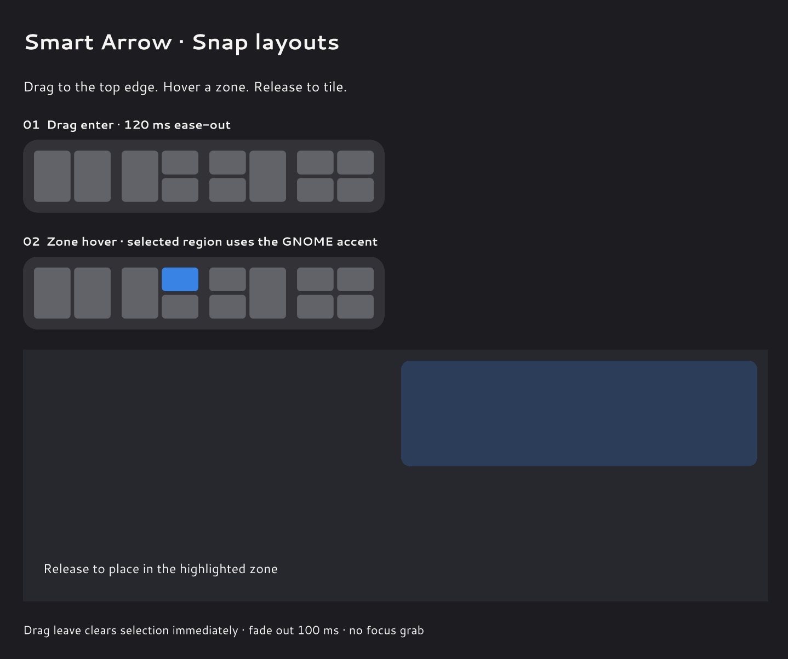

# Smart Arrow Tiling



Keyboard tiling and drag-and-drop layouts for **GNOME Shell 50**. Arrange up to four windows, swap positions, and resize shared boundaries with a **1 px gap** between windows.

## 📦 Install

From the project folder:

```bash
bash install.sh
```

Log out and back in after installing or updating. If needed, enable the extension:

```bash
gnome-extensions enable smart-arrow-tiling@kafeyn
```

Requires `gnome-extensions` and `glib-compile-schemas`.

## ⌨️ Keyboard

| Shortcut | Action |
|---|---|
| Super + Left / Right | Move to that side and restore half widths |
| Super + Left, Left / Right, Right | Switch to 1/3–2/3 widths |
| Super + Left, Up / Down | Top-left / bottom-left quarter |
| Super + Right, Up / Down | Top-right / bottom-right quarter |
| Super + Up / Down | Swap upper/lower slots in the current column |

Keep Super held and press sequence keys within **320 ms**. The first key acts immediately. One Left/Right press after a third-width command restores halves.

## 🔄 Layouts and swapping

Choose two halves, a left or right primary with two stacked windows, or four quarters.

With three windows, Left/Right gives the focused quarter a full-height half. Its former sibling keeps its top/bottom position beside the displaced window. With four windows, movement exchanges occupied quarters.

## 🖱️ Drag and resize

Start dragging to reveal the four fixed layout previews at the top of your monitor. Hover a zone and release to tile; **Escape** cancels. Layouts with too few slots are dimmed.

Resize a shared boundary to adjust neighboring tiles. Removing a window reflows its remaining column. Maximized windows can be tiled normally. Each monitor and workspace keeps its own layout.

Conflicting Super+Arrow shortcuts and native edge tiling are restored when the extension is disabled. Fullscreen windows, sticky windows, dialogs and non-resizable windows are excluded.

## 🐛 Debug

```bash
gnome-extensions info smart-arrow-tiling@kafeyn
journalctl --user -f -o cat | grep 'Smart Arrow Tiling'
```

Licensed under [LICENSE](LICENSE).
